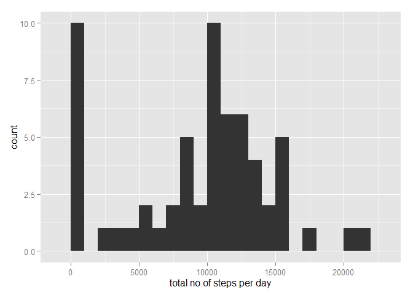

# Reproducible Research: Peer Assessment 1

**Data Processing**
  
  
  
  ```r
  unzip(zipfile = "activity.zip")
  data <- read.csv("activity.csv")
  ```

**Mean and median:**
  
  
  ```r
  totalsteps <- tapply(data$steps, data$date, sum, na.rm=TRUE)
  summary(totalsteps, na.rm=TRUE)
  ```
  
  ```
  ##    Min. 1st Qu.  Median    Mean 3rd Qu.    Max. 
  ##       0    6778   10400    9354   12810   21190
  ```

**Histogram for number of steps per day:**
  
  
  ```r
  library(ggplot2)
  ```
  
  ```
  ## Warning: package 'ggplot2' was built under R version 3.1.2
  ```
  
  ```r
  qplot(totalsteps, binwidth = 1000, xlab = "total no of steps per day")
  ```
  
   

**Average daily activity pattern:**
  
  
  ```r
  stepsinterval <-aggregate(steps ~ interval, data = data, FUN = mean)
  plot(stepsinterval, type = "l")
  ```
  
   

**Interval with max no. of steps:**
  
  
  ```r
  stepsinterval$interval[which.max(stepsinterval$steps)]
  ```
  
  ```
  ## [1] 835
  ```

**Imputing missing values:**

Total no. of missing values:

  
  ```r
  sum(is.na(data))
  ```
  
  ```
  ## [1] 2304
  ```
  
**Are there differences in activity patterns between weekdays and weekends?**

//

